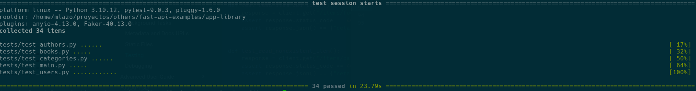

# App Library

The following repo will have information about an app oriented to a Library.

Some of the purposes to create the current repo were to promote the knowledge and practice of `FastApi`.

Glossary:

- [Setup](#setup)
	- [Docker](#docker)
	- [Locally](#locally)
		- [Initialize app](#initialize-app)
		- [DB Migrations](#db-migrations)
- [Unit Tests](#unit-tests)

## Setup

### Docker

- Start the db container:
```sh
docker-compose build --no-cache api
docker-compose up -d api && docker-compose run api migrate && docker-compose logs -f
```
- **[Optional]**, to load dev data:
```sh
docker-compose run api load_dev_data
```
- **[Optional]**, to create superuser:
```sh
docker-compose run api create_superuser
```
- **[Optional]**, to reset DB:
```sh
docker-compose down && \
	docker-compose up -d api && sleep 3 && \
	docker-compose run api migrate && \
	docker-compose run api load_dev_data && \
	docker-compose restart api && \
	docker-compose logs -f
```

### Locally

#### Initialize app

- Start the db container:
```sh
docker-compose up -d db && docker-compose logs --tail=10 -f db
```
- Create a virtualenv and install the app dependencies:
```sh
python3 -m venv venv
source venv/bin/activate
pip install -r requirements.txt
```
- Start the app:
```sh
uvicorn app.main:app --reload --reload-exclude venv
```
- Open a browser and hit the url: http://localhost:8000/docs
- (**Optional**) To get out of the virtualenv:
```sh
deactivate
```


#### DB Migrations

- Run the app migrations:
```sh
alembic upgrade head
```
- To generate a new revision:
```sh
alembic revision --autogenerate -m "new table"
```
- To check the current revision:
```sh
alembic current
```
- To check if there are pending revisions:
```sh
alembic check
```
- To run a specific revision:
```sh
alembic upgrade <revision-id>
```
- To check all revisions(migrations):
```sh
alembic history
```

## Unit Tests

- To run all unit tests:
```sh
pytest -v tests/
```
